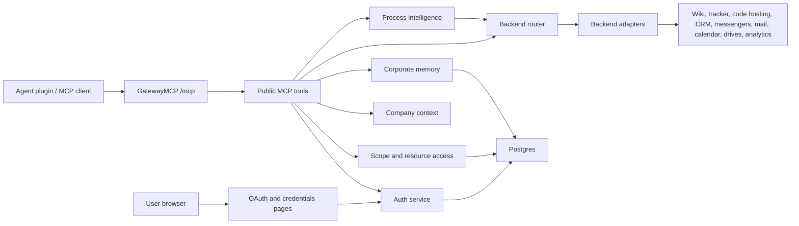

# GatewayMCP

> **Archived.** GatewayMCP development continues in [`comindspace/ai-native`](https://github.com/comindspace/ai-native): the full server now ships there in the `gateway/` directory, together with the skill platform and a one-command VM installer (`bootstrap.sh`). This standalone mirror stays readable; releases up to v0.2.0 remain available as tags. No further updates will land here.

[](../../actions/workflows/ci.yml)
[](LICENSE)

One MCP boundary between AI coding and operational assistants and the systems they must reach. Agents connect to GatewayMCP, authenticate once, and call a small, stable set of public MCP tools. Backend credentials, access rules, audit events, and memory stay inside the gateway runtime and its Postgres database. Agents never receive upstream service tokens.

> Status: early public release of a system that runs in production. The packaging (docs, examples, i18n) is still being polished. Admin UI strings are currently Russian; extraction is on the roadmap. [Читать по-русски](README.ru.md).

Why one gateway:

- **Single entry point.** Agents speak MCP to the gateway; the gateway speaks to backends: wiki, issue tracker, code hosting, CRM, messengers, mail, calendar, cloud drives, analytics.
- **One login.** People authenticate through OAuth (Yandex as the login provider out of the box); MCP-capable clients use the standard MCP OAuth flow (protected-resource metadata, dynamic client registration, PKCE).
- **Scopes and resource grants.** Coarse capabilities (`tools:call`, `gitlab:read`, ...) plus per-resource grants (a GitLab project, a tracker queue, a wiki document, a Telegram chat). Denies win over allows.
- **Secret isolation.** Per-user credentials are encrypted at rest; server-level tokens are disabled by default.
- **Audit by default.** Every tool call, decision, and error is recorded.
- **Sanitized surfaces.** A privacy gateway masks personal and secret-bearing data before it enters model context; process intelligence returns normalized, link-backed results instead of raw records.

Architecture at a glance:



Skills for assistants are packaged by the companion repository [`comindspace/ai-native`](https://github.com/comindspace/ai-native): a portable skill contract, a plugin pack builder for Claude Code, Codex, Cursor, OpenCode, OpenClaw, and Hermes, plus the skill telemetry contract this gateway ingests.

Quickstart:

```bash
cp deploy.env.example .env   # fill in Postgres password, OAuth app, one backend
docker compose up -d
curl http://localhost:8000/healthz
```

The MCP endpoint is served at `/mcp`. Host it behind HTTPS and set `GATEWAY_PUBLIC_URL` for a working OAuth flow. Security policy: [SECURITY.md](SECURITY.md). Contributing: [CONTRIBUTING.md](CONTRIBUTING.md). License: Apache-2.0 ([LICENSE](LICENSE), [NOTICE](NOTICE)).

---

For persistent Factory project registration, multi-instance GitLab credentials,
readiness probes and explicit Work retry, see [Factory project administration](docs/factory-project-registry.md).

Factory GitLab service connections are managed at `/admin/factory/connections`:
create/rotate a token, restrict repositories, test authentication and bind a registered
project. Agents discover permitted aliases with `gateway_factory_connections_list`.
The opt-in Gateway Git transport keeps upstream tokens on the server and limits
push to the active Work branch; rollout and worker commands are in the same guide.

## User Flow

Claude Code uses MCP OAuth directly:

```text
/plugin install gateway-mcp@company-agent-skills
/mcp
```

When Claude prompts for authentication, sign in with Yandex. The plugin points Claude to `https://gateway.example.com/mcp`; do not paste a Gateway bearer token into the Claude plugin config.

If Claude was already connected with an old token or the wrong account, open `/mcp`, clear authentication for the Gateway server, then reconnect and sign in again.

Quick checks after login:

```text
/mcp list
gateway_search_tools
gateway_company_get_source_of_truth
```

Agents without MCP OAuth support may still use the same MCP endpoint plus a Gateway bearer token as a fallback.

## Project Structure

- `gateway.py` - compatibility entrypoint for the `gateway-mcp` console script and legacy imports.
- `gateway_mcp/server.py` - FastMCP app assembly and registration of routes/tools.
- `gateway_mcp/routes/` - HTTP routes: health, metrics, OAuth callback, and user credentials UI.
- `gateway_mcp/tools/` - public MCP tools grouped by domain: company context, memory, markdown knowledge spaces, access admin, route discovery, and routed backend calls.
- `gateway_mcp/backends/` - private backend adapters by system, with one router that dispatches by `transport` from `gateway-tools.json`.
- `gateway_mcp/config.py`, `gateway_mcp/web.py`, `gateway_mcp/audit.py` - shared Gateway helpers.
- `gateway_backends.py` - compatibility wrapper for old imports of `call_backend`.
- `gateway_mcp/services/` - domain services for auth, access control, storage, migrations, observability, memory, markdown knowledge spaces, company context, and policy.
- `gateway_access.py`, `gateway_auth.py`, `gateway_storage.py`, `gateway_memory.py`, `gateway_company.py` - compatibility wrappers for old imports.

Validate locally:

```bash
python -m json.tool gateway-tools.json >/dev/null
python -m json.tool gateway-policy.json >/dev/null
python -m json.tool gateway-company-indexes.json >/dev/null
python -m compileall -q gateway_mcp gateway.py gateway_access.py gateway_auth.py gateway_backends.py gateway_company.py gateway_memory.py gateway_migrations.py gateway_observability.py gateway_policy.py gateway_storage.py
python -m unittest discover -s tests
```

Smoke-check a deployed Gateway:

```bash
python -m gateway_mcp.smoke --base-url https://gateway.example.com
```

With a Gateway token, the smoke check also initializes MCP, lists tools, and verifies that the route registry includes Yonote routes:

```bash
python -m gateway_mcp.smoke --base-url https://gateway.example.com --token "$GATEWAY_MCP_TOKEN"
```

## Public Tools

- `gateway_search_tools(query)` - list known internal tool routes. Scope: `tools:read`.
- `gateway_call_tool(tool_name, arguments_json)` - checks `tools:call`, route scope, and DB-backed resource ACL before proxying to private MCP servers.
- `gateway_company_get_source_of_truth()` - return the company source-of-truth map. Scope: `company:read`.
- `gateway_company_bootstrap_context(query, limit)` - return source-of-truth map, Yonote company index, company memory, and relevant company sources. Scope: `company:read`.
- `gateway_company_search(query, kind, limit, include_sources)` - search the Yonote company index and source systems. Scope: `company:read`.
- `gateway_company_get(kind, item_id)` - get a company person/team/project/process/client/system/etc. Scope: `company:read`.
- `gateway_memory_write(...)` - store short-term session/task memory or medium-term project/team memory in Postgres. Scope: `memory:write`.
- `gateway_memory_search(...)` - search short/medium memory and optionally source-backed long-term knowledge. Scope: `memory:read`.
- `gateway_memory_sources_search(query, limit, include_yonote)` - search long-term source-backed knowledge from Yonote/templates/ADR/docs. Scope: `memory:read`.
- `gateway_memory_summarize_session(session_id, notes, ...)` - store a compact short-term session/task summary with TTL. Scope: `memory:write`.
- `gateway_memory_forget(entry_id)` - delete a memory entry created by the current user; admins may delete any entry. Scope: `memory:write`.
- `gateway_knowledge_spaces(include_personal)` - list personal and group markdown knowledge spaces visible to the current user. Scope: `memory:read`.
- `gateway_knowledge_space_get(space)` - show metadata, members, and document count for one knowledge space. Scope: `memory:read`.
- `gateway_knowledge_space_create(slug, title, description, members_json)` - create a group knowledge space; the creator becomes admin. Scope: `memory:write`.
- `gateway_knowledge_member_add(space, subject, role)` / `gateway_knowledge_member_remove(space, subject)` - manage group-space members. Scope: `memory:write` plus space admin role.
- `gateway_knowledge_document_put(title, content, space, ...)` - create or update a markdown document in a personal or group space. Scope: `memory:write` plus space writer role.
- `gateway_knowledge_document_get(document, space)` - read a markdown document from an accessible space. Scope: `memory:read`.
- `gateway_knowledge_search(query, space, limit, ...)` - search accessible markdown knowledge spaces and return citations. Scope: `memory:read`.
- `gateway_knowledge_document_delete(document, space)` - soft-delete a markdown document into the space-local trash. Scope: `memory:write` plus space writer role.
- `gateway_knowledge_document_versions(document, space, limit)` - list retained document versions. Scope: `memory:read`.
- `gateway_knowledge_document_restore(document, version_id, space)` - restore a retained version after archiving the current document. Scope: `memory:write` plus space writer role.
- `gateway_knowledge_trash_list(space, limit)` / `gateway_knowledge_trash_restore(trash_id, space)` - inspect and restore soft-deleted documents. Scope: `memory:read` or `memory:write` plus the matching space role.
- `gateway_knowledge_ingest_file(source_path, space, ...)` - import a UTF-8 text/markdown file from an allowlisted server directory into a knowledge space. Scope: `memory:write` plus space writer role.
- `gateway_knowledge_reindex(space)` - rebuild markdown indexes for accessible spaces. Scope: `memory:write`.
- `gateway_knowledge_access_audit(space)` - show the current user's effective knowledge-space access. Scope: `memory:read`.
- `gateway_process_events_search(query, period_days, systems_json, project_ids_json, limit)` - return sanitized normalized process events from Yonote, Bitrix24, Tracker, and GitLab. Scope: `process:read`.
- `gateway_process_candidates_discover(events_json, ...)` - discover repeated process candidates from normalized events. Scope: `process:read`.
- `gateway_process_compare_with_yonote(candidates_json, ...)` - compare discovered process candidates with Yonote process/source-of-truth pages. Scope: `process:read`.
- `gateway_process_rebuild_backlog(candidates_json, comparisons_json, ...)` - build a staff-reviewed Process Rebuild Backlog. Scope: `process:read`.
- `gateway_project_scope_resolve(project_id, signal_summary, scope_id, limit)` - return source-backed project/scope candidates for agent classification. Scope: `factory:read`.
- `gateway_work_intake(...)` - create a portable local or factory Work Contract. Scope: `factory:write` plus project resource access.
- `gateway_work_search(...)` / `gateway_work_get(work_id)` - inspect authorized work metadata and evidence. Scope: `factory:read` plus project resource access.
- `gateway_work_claim(work_id, project_id, lease_seconds)` - reserve queued Factory work and validate registered project readiness before admitting the lease. Returns `claimed: false` if preflight blocks the Work. Scope: `factory:claim` plus project write access. See [claim preflight and rollout](docs/factory-project-registry.md#claim-preflight).
- `gateway_work_artifact_record(...)` - append one metadata-only planning, implementation, verification, review, delivery, or production-feedback record to the server-validated SHA-256 artifact chain. Scope: `factory:write` plus project resource access.
- `gateway_work_event(...)` / `gateway_work_complete(...)` / `gateway_work_accept(...)` - record phase changes, verified result, and independent review decision. Scope: `factory:write` plus project resource access.
- `gateway_work_metrics(project_id, days)` - compare local and factory flow on signal-to-result, acceptance, blocking, correction, evidence, and administration. The response includes `blocked_rate` and the canonical `p50_correction_rounds`; `avg_correction_rounds` remains available for compatibility. Scope: `factory:read` plus project resource access.
- `gateway_telemetry_skill_started(...)` - record that a local Claude/Codex/Cursor/Hermes skill started. Scope: `telemetry:write`.
- `gateway_telemetry_skill_completed(...)` - record successful skill completion, duration, MCP routes, and missing scopes. Scope: `telemetry:write`.
- `gateway_telemetry_skill_failed(...)` - record failed skill completion with error class, not stack traces. Scope: `telemetry:write`.
- `gateway_telemetry_session_finished(...)` - close skill runs left open when an agent session ends. Scope: `telemetry:write`.
- `gateway_telemetry_skill_stats(...)` - return aggregated assistant skill usage stats. Scope: `telemetry:read`.
- `gateway_telemetry_usage_report(...)` - record actual or estimated model token/cost usage. Scope: `telemetry:write`.
- `gateway_telemetry_usage_summary(...)` - aggregate model usage by agent, skill, project, provider, model, and source quality. Scope: `telemetry:read`.
- `gateway_admin_list_access(...)` - list DB-backed scope/resource grants. Scope: `access:read`.
- `gateway_admin_explain_access(...)` - explain allow/deny for one user/resource/action. Scope: `access:read`.
- `gateway_admin_grant_scope(...)` / `gateway_admin_revoke_scope(...)` - manage DB-backed scope grants. Scope: `access:admin`; `dry_run=true` by default.
- `gateway_admin_grant_resource(...)` / `gateway_admin_revoke_resource(...)` - manage DB-backed resource ACL grants. Scope: `access:admin`; `dry_run=true` by default.
- `gateway_admin_audit_search(...)` - search redacted audit metadata, including by `gateway_request_id`. Scope: `telemetry:read`.
- `gateway_admin_audit_summary(...)` - aggregate audit events by event, tool, system, decision, and status. Scope: `telemetry:read`.
- `gateway_admin_access_package_catalog()` - list versioned company roles such as project manager, AI-Native engineer, factory worker, sales manager, knowledge curator, and independent reviewer. Scope: `access:read`.
- `gateway_admin_grant_access_package(...)` / `gateway_admin_revoke_access_package(...)` - atomically assign or revoke all scopes and resource grants belonging to one role without touching separately issued grants. Scope: `access:admin`; `dry_run=true` by default.
- `gateway_admin_list_access_packages(...)` - inspect active and revoked package assignments. Scope: `access:read`.
- `gateway_access_profile()` - show the current employee identity, effective scopes, assigned access packages, and recent requests. Scope: `access:request`.
- `gateway_access_package_catalog()` - list versioned business access packages available for employee requests. Scope: `access:request`.
- `gateway_access_request_create(...)` / `gateway_access_request_list(...)` / `gateway_access_request_cancel(...)` - create, inspect, or cancel the current employee's access request. Scope: `access:request`. Requests never grant access automatically.
- `gateway_admin_access_request_list(...)` / `gateway_admin_access_request_decide(...)` - review pending requests and approve or reject them. Scopes: `access:read` and `access:admin`; decisions default to `dry_run=true`.
- `gateway_approval_create(...)` - create a time-limited, artifact-bound approval request; four-eyes mode is enabled by default. Scope: `approvals:write`.
- `gateway_approval_get(...)` / `gateway_approval_list(...)` - inspect visible or assigned approvals and their immutable event history. Scope: `approvals:read`.
- `gateway_approval_decide(...)` / `gateway_approval_comment(...)` - approve, reject, request information, or add clarification. Decisions are atomic and expired approvals cannot be accepted. Scope: `approvals:write`.
- `gateway_file_upload_create(...)` / `gateway_file_upload_status(upload_id)` - create and inspect a short-lived binary upload session. Scope: `files:write` or `files:read`.
- `gateway_file_download_create(upload_id)` / `gateway_file_download_status(download_id)` - create and inspect a one-time binary download session. Scope: `files:read`.
- `gateway_privacy_classify(text, policy)` - return sensitivity types, actions, and positions without echoing detected values. Scope: `privacy:use`.
- `gateway_privacy_sanitize_text(text, policy)` - pseudonymize personal data and irreversibly redact credentials before a downstream handoff. Scope: `privacy:use`.
- `gateway_call_tool_sanitized(tool_name, arguments_json, policy)` - call an authorized read-only backend route and sanitize its result before it enters agent context. Scopes: `tools:call`, `privacy:use`, and the route's read scope.

## Backend Routes

`gateway_call_tool` now routes implemented tools to private backends from inside GatewayMCP. Agents see only GatewayMCP; backend tokens stay in the Gateway runtime.

Agent responses contain business data, the upstream status, write idempotency state when relevant, and a short `gateway_request_id`. Backend paths, transport details, route metadata, RBAC subjects, matched grants, and constraints stay in the server audit. Use `gateway_request_id` to correlate a compact agent-visible error with full operational diagnostics.

Administrators can search the redacted journal at `/admin/audit` by period, user, system, event, tool, decision, status, or `gateway_request_id`. Journal payloads are not rendered in the browser.

Implemented routes:

- Yonote read: `yonote.documents.search`, `yonote.documents.get`, `yonote.documents.list`, `yonote.documents.export`.
- Yonote write: `yonote.documents.create`, `yonote.documents.update`.
- Tracker read: `tracker.issues.search`, `tracker.issues.count`, `tracker.issues.get`, `tracker.transitions.list`, `tracker.queues.list`, `tracker.queues.fields`, `tracker.worklogs.list`, `tracker.worklogs.search`.
- Tracker write: `tracker.issues.create`, `tracker.issues.update`, `tracker.comments.add`, `tracker.transitions.execute`, `tracker.worklogs.create`, `tracker.worklogs.update`, `tracker.worklogs.delete`.
- GitLab read: `gitlab.projects.search`, `gitlab.project.get`, `gitlab.files.get`, `gitlab.merge_requests.list`, `gitlab.merge_requests.get`, `gitlab.merge_requests.changes`, `gitlab.merge_requests.diffs.list`, `gitlab.merge_request_notes.list`, `gitlab.merge_request_approvals.get`, `gitlab.pipelines.list`, `gitlab.pipeline_jobs.list`, `gitlab.pipeline_jobs.get`, `gitlab.pipeline_jobs.trace`.
- GitLab write: `gitlab.branches.create`, `gitlab.commits.create`, `gitlab.merge_requests.create`, `gitlab.merge_request_notes.create`, `gitlab.merge_request_approvals.approve`, `gitlab.merge_requests.merge`.
- GitLab deploy: `gitlab.pipeline_jobs.play` requires the separate `gitlab:deploy` scope. A call must include the id of an approved `production_deploy` request as `approval_ref` and a unique `idempotency_key`; in strict resource-policy mode, grant the `deploy` action only for approved project ids. Ordinary `gitlab:write` does not permit manual CI jobs.

Protected operations consume a real Gateway approval, not an arbitrary reference string. Create the approval with a payload bound to the tool and immutable invocation fields:

```json
{
  "approval_type": "production_deploy",
  "subject": "Deploy project 123 job 100",
  "required_role": "release-reviewers",
  "payload_json": "{\"tool_name\":\"gitlab.pipeline_jobs.play\",\"arguments\":{\"project_id\":123,\"job_id\":100}}",
  "four_eyes": true
}
```

After an independent reviewer approves it, the creator or the explicit `metadata.executor_subject` may execute the matching operation. GatewayMCP verifies status, expiry, approval type, executor, tool, and argument subset, then atomically consumes the approval before contacting the backend. A successful idempotent replay returns the cached result before consumption is checked. Any uncertain or failed first execution requires a new approval rather than silently reusing the old one.
- Infra read: `infra.servers.search`, `infra.servers.get`.
- Infra SSH diagnostics: `infra.ssh.exec` runs only allowlisted read-only SSH commands through a server-side credential handle. It never returns private keys to agents.
- Yandex Disk read: `yandex_disk.resources.get`, `yandex_disk.resources.files`, `yandex_disk.resources.download_link`.
- Yandex Disk write: `yandex_disk.resources.upload_link`, `yandex_disk.resources.mkdir`, `yandex_disk.resources.copy`, `yandex_disk.resources.move`, `yandex_disk.resources.delete`.
- Bitrix24 read: `bitrix24.crm.search`, `bitrix24.leads.list`, `bitrix24.deals.list`, `bitrix24.deals.get`, `bitrix24.deals.fields`, `bitrix24.contacts.list`, `bitrix24.companies.list`, `bitrix24.companies.get`, `bitrix24.companies.fields`, `bitrix24.current_user.get`, `bitrix24.users.list`, `bitrix24.users.get`, `bitrix24.statuses.list`, `bitrix24.sales_funnel.health`, `bitrix24.timeline.comments.list`, `bitrix24.activities.list`, `bitrix24.tasks.list`.
- Bitrix24 write: `bitrix24.leads.create`, `bitrix24.deals.create`, `bitrix24.deals.update`, `bitrix24.companies.create`, `bitrix24.companies.update`, `bitrix24.companies.upsert`, `bitrix24.timeline.comment.add`, `bitrix24.timeline.comment.add_with_files`, `bitrix24.deals.attach_file`, `bitrix24.disk.folder.uploadfile`, `bitrix24.disk.storage.uploadfile`, `bitrix24.activities.add`, `bitrix24.activities.update`, `bitrix24.tasks.add`, `bitrix24.tasks.update`.
- OpenRouter audio: `openrouter.audio.models`, `openrouter.audio.transcribe`.
- Telegram read: `telegram.chats.list`, `telegram.messages.get`, `telegram.messages.search`, `telegram.files.download`.
- Telegram write: `telegram.messages.send`.
- Notifications write: `notifications.skill_update.send` posts post-merge skill update notifications to the configured team chat through the Gateway service identity.
- Mail read: `mail.messages.search`.
- Mail send: `mail.messages.send`.
- Calendar read: `calendar.calendars.list`, `calendar.events.search`.

Unknown or future MCP backends should be added only after their upstream contract is known.

Example:

```json
{
  "tool_name": "tracker.issues.search",
  "arguments_json": "{\"query\":\"Queue: OPS\",\"per_page\": 10}"
}
```

For routes with complex payloads, use `body`:

```json
{
  "tool_name": "tracker.issues.create",
  "arguments_json": "{\"body\":{\"queue\":\"OPS\",\"summary\":\"Check Gateway route\",\"description\":\"Created through GatewayMCP\"}}"
}
```

Bitrix24 accepts either flat arguments or `params`:

```json
{
  "tool_name": "bitrix24.leads.list",
  "arguments_json": "{\"params\":{\"filter\":{\"STATUS_ID\":\"NEW\"},\"select\":[\"ID\",\"TITLE\"],\"start\":0}}"
}
```

Timeline comments can attach files directly through Bitrix24 `FILES`. For agent calls, upload the binary outside the MCP context and pass only its `upload_id`:

```text
1. Call gateway_file_upload_create(filename, content_type, size_bytes, sha256).
2. PUT the file bytes to upload_url with the returned X-Gateway-Upload-Token header.
3. Call bitrix24.timeline.comment.add_with_files or bitrix24.deals.attach_file with {"upload_id":"..."}.
```

```json
{
  "tool_name": "bitrix24.timeline.comment.add_with_files",
  "arguments_json": "{\"params\":{\"entity_type\":\"deal\",\"entity_id\":1709,\"comment\":\"Quote attached\",\"files\":[{\"upload_id\":\"4d2f22bd-f4af-41e5-a23e-d95c4e99e0f5\"}]}}"
}
```

For deal-focused file attachments, agents can use the shorter helper:

```json
{
  "tool_name": "bitrix24.deals.attach_file",
  "arguments_json": "{\"params\":{\"deal_id\":1753,\"comment\":\"Quote attached\",\"files\":[{\"upload_id\":\"4d2f22bd-f4af-41e5-a23e-d95c4e99e0f5\"}]}}"
}
```

Legacy `content_base64` input remains accepted for compatibility, but should not be used for new agent flows because it spends model context on binary data.

To attach a file received in a Telegram chat, download it into the Gateway transfer store and pass its `upload_id` to Bitrix24. The raw bytes should move between HTTP endpoints without being copied through an LLM response.

```json
{"tool_name": "telegram.files.download", "arguments_json": "{\"chat_id\":-1001234567890,\"message_id\":42}"}
```

Message listings from `telegram.messages.get` and `telegram.messages.search` include a `media` object when a message carries a file attachment, so agents can discover which messages have downloadable files.

Company cards can be created or updated and linked to a deal in one call:

```json
{
  "tool_name": "bitrix24.companies.upsert",
  "arguments_json": "{\"params\":{\"title\":\"Acme Development\",\"website\":\"https://example.com\",\"deal_id\":1753}}"
}
```

If a file needs to live in Bitrix24 Drive first, use `bitrix24.disk.folder.uploadfile` or `bitrix24.disk.storage.uploadfile` with `fileContent:["file.pdf","base64"]`. The Bitrix24 webhook must have the matching CRM and Disk/Drive permissions.

OpenRouter audio transcription accepts a Gateway `upload_id`. The legacy `file_path` argument remains available for server-side files and is restricted by `OPENROUTER_ALLOWED_AUDIO_DIRS`.

Telegram uses the Gateway host session. Prefer `TELEGRAM_SESSION_STRING` for containerized deployments; otherwise pre-login the configured `TELEGRAM_SESSION_NAME` session file before running GatewayMCP.

Post-merge skill update notifications should use `notifications.skill_update.send`, not direct `telegram.messages.send`. Set `GATEWAY_SKILL_UPDATE_CHAT_ID` (legacy `GATEWAY_COMIND_CHAT_ID` and `GATEWAY_COMIND_MR_REVIEW_CHAT_ID` are still honored) to the chat that receives skill update notices. The route accepts skill metadata, formats the message server-side, and sends through the configured Gateway Telegram session, preferably a dedicated service identity.

## Employee notifications

GatewayMCP provides a durable employee inbox independently of Telegram, Slack, or Hermes. Notification events, recipients, read receipts, browser subscriptions, and delivery attempts are stored in Postgres. The `notification-worker` Compose service polls the Postgres outbox and delivers Web Push; Redis is not required.

Employees open `/notifications`, sign in through the normal Gateway OAuth flow, and can:

- read personal, group, role, and team notifications;
- mark one or all notifications as read;
- enable or disable operating-system browser notifications per device.

Agents use the dedicated MCP tools:

- `gateway_notification_publish` with `notifications:write`;
- `gateway_notifications_list`, `gateway_notification_get`, `gateway_notification_ack`, and `gateway_notification_topic_update` with `notifications:read`.

`recipients_json` is an array of `{ "type": "user|group|role|team|project", "key": "..." }`. An empty array sends the event back to the current actor. Use a stable `idempotency_key` for retryable events such as Work Contract completion. Prefer `user`, `group`, `role`, or `team` recipients. A project identifier is an internal access boundary and event context; employees do not enter project codes or manage project subscriptions in the inbox. The legacy project-topic API remains available for compatible clients. Web Push lock-screen text is intentionally generic; the event body and action link remain inside the authenticated inbox.

Generate one VAPID key pair for each Gateway installation and store the values only in the server environment:

```bash
uv run python -c "import base64; from cryptography.hazmat.primitives.serialization import Encoding, PublicFormat; from py_vapid import Vapid; v=Vapid(); v.generate_keys(); enc=lambda b:base64.urlsafe_b64encode(b).rstrip(b'=').decode(); print('GATEWAY_WEB_PUSH_VAPID_PRIVATE_KEY='+enc(v.private_key.private_numbers().private_value.to_bytes(32,'big'))); print('GATEWAY_WEB_PUSH_VAPID_PUBLIC_KEY='+enc(v.public_key.public_bytes(Encoding.X962,PublicFormat.UncompressedPoint)))"
```

Set `GATEWAY_WEB_PUSH_VAPID_SUBJECT` to a monitored `mailto:` address. The public key is exposed to authenticated browsers; the private key is used only by `notification-worker`.

Yandex Tracker, Yandex Disk, and Yandex Mail use the Yandex OAuth token of the employee who logged in through GatewayMCP. Do not put personal Tracker, Disk, or Mail credentials into the shared server environment.

If Tracker routes return an upstream `403` that says `tracker:read OAuth scope is required`, add the Tracker scopes to the Yandex OAuth application and have the employee re-authenticate through GatewayMCP. The existing Gateway token may be valid while the stored upstream Yandex token is missing that scope.

If Mail routes return `IMAP AUTHENTICATIONFAILED`, check both sides: the Yandex OAuth application must request Mail IMAP/SMTP scopes, and IMAP must be enabled for the user's Yandex mailbox.

Calendar is different: Yandex CalDAV is documented through per-user app passwords. Do not put a personal CalDAV password into the shared server environment. GatewayMCP should store a per-user encrypted Calendar app password under the `yandex-caldav` credential provider before enabling Calendar routes for that user. If no app password is stored, Calendar routes return `credential_missing` and point the user to `/credentials`.

Legacy MCP migration status:

- Routed through GatewayMCP: Yonote, Yandex Tracker, GitLab, Yandex Disk, Yandex Mail, Bitrix24, Telegram, Calendar/CalDAV, OpenRouter audio.
- Gateway-native, not proxied as legacy MCP: company context, corporate memory, access administration.
- Local agent utilities stay local by design: filesystem, sequential thinking, browser/puppeteer-style automation.
- Google Sheets is intentionally not part of the Gateway route set.

## Local Dev

Default mode is stdio with auth disabled:

```powershell
uv run gateway-mcp
```

## HTTP Gateway With Auth

Run the protected remote MCP endpoint directly:

```powershell
$env:GATEWAY_TRANSPORT = "streamable-http"
$env:GATEWAY_AUTH_ENABLED = "true"
$env:GATEWAY_HOST = "0.0.0.0"
$env:GATEWAY_PORT = "8000"
$env:GATEWAY_PUBLIC_URL = "https://mcp.example.com"
$env:GATEWAY_ISSUER_URL = "https://mcp.example.com"
$env:GATEWAY_RESOURCE_URL = "https://mcp.example.com/mcp"
$env:GATEWAY_JWT_SECRET = "<secret-from-secret-manager>"
$env:GATEWAY_DATABASE_URL = "postgresql://gateway_mcp:<password>@localhost:5432/gateway_mcp"
$env:YANDEX_OAUTH_CLIENT_ID = "<yandex-oauth-client-id>"
$env:YANDEX_OAUTH_CLIENT_SECRET = "<yandex-oauth-client-secret>"
uv run gateway-mcp --transport streamable-http
```

Run database migrations before starting the service:

```powershell
uv run gateway-mcp migrate up
```

Or run the full Gateway + Postgres stack:

```powershell
$env:GATEWAY_JWT_SECRET = "<32+ byte secret>"
$env:YANDEX_OAUTH_CLIENT_ID = "<yandex-oauth-client-id>"
$env:YANDEX_OAUTH_CLIENT_SECRET = "<yandex-oauth-client-secret>"
docker compose up --build
```

## GitLab CI/CD Deployment

This repository includes a GitLab CI/CD pipeline for the production Gateway host.

Pipeline stages:

- `validate` - validates JSON registries and compiles Python modules.
- `build_gateway_image` - builds the Gateway Docker image and pushes it to the GitLab Container Registry.
- `deploy_gateway` - manual production deployment through the shell runner tagged `gateway-prod`.

The production runner host keeps secrets in `/opt/gateway-mcp/.env`. The repository only contains `deploy.env.example`; never commit the real `.env`.

Initial server setup:

```bash
sudo mkdir -p /opt/gateway-mcp
sudo chown -R gitlab-runner:gitlab-runner /opt/gateway-mcp
sudo install -m 0600 deploy.env.example /opt/gateway-mcp/.env
sudo editor /opt/gateway-mcp/.env
```

Required production values:

- `POSTGRES_PASSWORD`
- `GATEWAY_JWT_SECRET`
- `GATEWAY_USER_TOKEN_ENCRYPTION_KEY`
- `GATEWAY_PUBLIC_URL`
- `GATEWAY_ISSUER_URL`
- `GATEWAY_RESOURCE_URL`
- `YANDEX_OAUTH_CLIENT_ID`
- `YANDEX_OAUTH_CLIENT_SECRET`
- `YANDEX_OAUTH_SCOPES`
- `YANDEX_DISK_OAUTH_CLIENT_ID`
- `YANDEX_DISK_OAUTH_CLIENT_SECRET`
- `YANDEX_DISK_OAUTH_SCOPES`
- `GOOGLE_OAUTH_CLIENT_ID`
- `GOOGLE_OAUTH_CLIENT_SECRET`
- `GOOGLE_OAUTH_SCOPES`

Backend integrations are enabled by setting service credentials in the server `.env` only for shared systems such as Yonote, GitLab, Bitrix24, OpenRouter, and Telegram. Yandex Tracker, Yandex Disk, and Yandex Mail should normally use the logged-in employee's Yandex OAuth token stored by GatewayMCP after login.

Manual deploy flow:

```text
merge to main -> build image -> run manual deploy_gateway job
```

The deploy job copies `docker-compose.deploy.yml` to `/opt/gateway-mcp/docker-compose.yml`, writes the exact image tag into `/opt/gateway-mcp/.image.env`, runs `docker compose pull`, starts the stack, and checks `http://127.0.0.1:8000/healthz`.

Register the Yandex OAuth callback URL:

```text
https://mcp.example.com/auth/yandex/callback
```

Employee login for fallback bearer-token agents:

```text
https://mcp.example.com/auth/yandex/login
```

The callback returns an internal Gateway bearer token. Configure only non-OAuth agent runtimes with:

```text
Authorization: Bearer <gateway-token>
```

Claude Code should use the MCP OAuth flow and should not store the bearer token in plugin configuration.

GatewayMCP also stores the user's Yandex OAuth token encrypted in Postgres and uses it only server-side when routing Yandex Tracker, Yandex Disk, and Yandex Mail calls. GitLab uses a per-user personal access token saved from `/credentials`. Agents receive only the internal Gateway bearer token, not raw Yandex or GitLab tokens.

Yandex may limit how many permissions can be attached to a single OAuth application. GatewayMCP therefore supports separate Yandex OAuth apps: the main `YANDEX_OAUTH_*` app for login, Tracker, and Mail, and the `YANDEX_DISK_OAUTH_*` app for Disk (`cloud_api:disk.read`, `cloud_api:disk.write`, `cloud_api:disk.info`). Google Drive, Google Docs, and Google Sheets use a separate `GOOGLE_OAUTH_*` app with callback `https://mcp.example.com/auth/google/callback`. If a scope is missing, GatewayMCP authentication can succeed while the routed backend call still fails upstream.

Yandex Disk API applications may use the fixed `https://oauth.yandex.ru/verification_code` redirect. In that case users open `/credentials`, click **Получить код Yandex Disk**, approve Disk access in Yandex, copy the confirmation code, and paste it back into the GatewayMCP form. Platform admins use the same code-based flow in the **Сервисные аккаунты** table to bind Disk access for service actors such as Hermes profiles.

After login, users can open `/credentials` to manage per-user credentials that cannot be obtained through OAuth. Calendar app passwords and GitLab personal access tokens are saved there encrypted and can be deleted by the same user.

Platform administrators manage global service connections at `/admin/integrations`. Bitrix24, Yonote, OpenRouter, the privacy-preserving external LLM proxy, Tracker organization settings, GitLab endpoint settings, and the notification Telegram bot can be saved there without exposing secrets to an agent. Values are encrypted in Postgres, versioned on every update, can expire or be disabled, and retain the result of the latest connection check. Existing environment variables remain a deployment fallback until an admin-managed record is created. A disabled or expired managed record intentionally blocks that fallback.

## Configuration

- `GATEWAY_TOOLS_FILE` - path to gateway route registry, default `gateway-tools.json`.
- `GATEWAY_POLICY_FILE` - policy registry, default `gateway-policy.json`.
- `GATEWAY_DATABASE_URL` - Postgres DSN for OAuth state and audit events.
- `GATEWAY_MIGRATIONS_DIR` - SQL migrations directory, default `migrations`.
- `GATEWAY_AUDIT_LOG` - JSONL fallback audit log path when Postgres is not configured, default `gateway-audit.jsonl`.
- `GATEWAY_USER_TOKEN_ENCRYPTION_KEY` - Fernet key for encrypting stored employee OAuth tokens. If omitted, Gateway derives a key from `GATEWAY_JWT_SECRET`; a dedicated key is preferred for production.
- `GATEWAY_ALLOWED_EMAIL_DOMAINS` - comma-separated domain allowlist. Overrides policy domains when set.
- `GATEWAY_REQUIRED_SCOPES` - legacy route-level setting. GatewayMCP now advertises `GATEWAY_SUPPORTED_SCOPES` to MCP clients and enforces real authorization at public-tool and routed-tool level.
- `GATEWAY_SUPPORTED_SCOPES` - optional override for scopes advertised through OAuth authorization-server and protected-resource metadata. Defaults to the full Gateway scope catalog.
- `GATEWAY_RESOURCE_POLICY_MODE` - resource ACL mode: `permissive` allows calls with no matching resource policy, `strict` requires an allow grant. Default `permissive`.
- `GATEWAY_ALLOW_SERVER_YANDEX_TOKENS` - optional break-glass fallback for server-level Yandex tokens. Default `false`.
- `GATEWAY_ALLOW_SERVER_GITLAB_TOKEN` - optional break-glass fallback for server-level GitLab token. Default `false`.
- `YANDEX_OAUTH_ACCESS_TOKEN` - optional break-glass server-level Yandex OAuth token used only when `GATEWAY_ALLOW_SERVER_YANDEX_TOKENS=true`.
- `YANDEX_MAIL_IMAP_HOST`, `YANDEX_MAIL_IMAP_PORT` - Yandex Mail IMAP XOAUTH2 endpoint, defaults `imap.yandex.com:993`.
- `YANDEX_MAIL_SMTP_HOST`, `YANDEX_MAIL_SMTP_PORT` - Yandex Mail SMTP XOAUTH2 endpoint, defaults `smtp.yandex.com:465`.
- `GATEWAY_TOKEN_TTL_SECONDS` - internal JWT TTL, default `31536000` (1 year).
- `GATEWAY_REFRESH_TOKEN_TTL_SECONDS` - MCP OAuth refresh-token TTL, default `31536000` (1 year). Refresh tokens are rotated on every use and can be revoked.
- `GATEWAY_WEB_PUSH_VAPID_PUBLIC_KEY` - URL-safe Base64 public P-256 VAPID key returned to authenticated browsers on `/notifications`.
- `GATEWAY_WEB_PUSH_VAPID_PRIVATE_KEY` - matching private VAPID key used only by the notification delivery worker.
- `GATEWAY_WEB_PUSH_VAPID_SUBJECT` - monitored VAPID contact, default `mailto:admin@example.com`.
- `GATEWAY_NOTIFICATION_POLL_SECONDS` - Postgres outbox polling interval for `notification-worker`, default `2`.
- `GATEWAY_NOTIFICATION_BATCH_SIZE` - maximum Web Push deliveries claimed per worker iteration, default `25`.
- `GATEWAY_NOTIFICATION_MAX_ATTEMPTS` - maximum delivery attempts before an outbox item becomes failed, default `8`.
- `GATEWAY_WEB_PUSH_TIMEOUT_SECONDS` - outbound Web Push request timeout, default `10` seconds and capped at `60`.
- `GATEWAY_SERVER_VERSION` - GatewayMCP version advertised by MCP `server/discover`, default `0.1.0`.
- `GATEWAY_STATELESS_LEGACY_HTTP` - makes pre-2026 Streamable HTTP calls stateless under MCP SDK v2. Modern `2026-07-28` calls are always stateless. Default `true`.
- `GATEWAY_MAX_REQUEST_BODY_BYTES` - maximum Streamable HTTP request body accepted by MCP SDK v2, default `4194304`.
- `GATEWAY_MCP_CATALOG_TTL_MS` - private cache hint for MCP discovery and catalog results, default `300000`.
- `GATEWAY_CIMD_ENABLED` - advertises and accepts OAuth Client ID Metadata Documents when `true`. Default `false`, so MCP clients use the declared dynamic registration endpoint. Enable only when client metadata URLs are reliably reachable from the Gateway.
- `GATEWAY_CIMD_ALLOWED_HOSTS` - optional comma-separated allowlist for OAuth Client ID Metadata Document hosts when CIMD is enabled. Private and local addresses are always rejected.
- `GATEWAY_OAUTH_ALLOWED_CUSTOM_SCHEMES` - optional comma-separated allowlist for native-client callback schemes used during dynamic OAuth registration. Set it to `cursor` to accept Cursor's `cursor://anysphere.cursor-mcp/oauth/callback`; HTTPS and HTTP loopback callbacks remain accepted without this setting.
- `GATEWAY_IDEMPOTENCY_TTL_SECONDS` - retention period for write-call idempotency records, default `86400`.
- `GATEWAY_MANAGED_CONNECTION_CACHE_SECONDS` - runtime cache for decrypted managed service connections, default `5` seconds.
- `GATEWAY_FILE_TRANSFER_DIR` - private server directory for short-lived binary transfers, default `/data/gateway/files`. Docker Compose mounts the persistent `gateway-files` volume there.
- `GATEWAY_FILE_TRANSFER_MAX_BYTES` - maximum upload size, default `104857600` bytes.
- `GATEWAY_FILE_UPLOAD_TTL_SECONDS` - upload availability period, default `3600` seconds and capped at one day.
- `GATEWAY_FILE_DOWNLOAD_TTL_SECONDS` - one-time download link lifetime, default `300` seconds and capped at one hour.
- `GATEWAY_PRIVACY_POLICY` - default privacy policy: `standard` masks credentials and personal identifiers; `strict` also generalizes dates of birth and financial values.
- `GATEWAY_PRIVACY_HMAC_SECRET` - dedicated secret for stable, actor-bound pseudonyms. If omitted, the Gateway JWT secret is used; a separate random production value is preferred.
- `GATEWAY_PRIVACY_TERMS_FILE` - optional JSON file containing company-specific terms to pseudonymize, for example employee, client, project, or contract names.
- `GATEWAY_LLM_UPSTREAM_URL`, `GATEWAY_LLM_UPSTREAM_API_KEY` - OpenAI-compatible provider used only behind the privacy proxy. These values can be stored at `/admin/integrations` instead of the environment.
- `GATEWAY_LLM_DEFAULT_MODEL`, `GATEWAY_LLM_ALLOWED_MODELS` - optional default model and comma-separated model allowlist for the privacy proxy.
- `GATEWAY_LLM_PROXY_MAX_BODY_BYTES`, `GATEWAY_LLM_PROXY_TIMEOUT_SECONDS` - proxy request size and upstream timeout limits, default `4194304` bytes and `180` seconds.
- `GATEWAY_LLM_ALLOW_INSECURE_UPSTREAM` - permits an HTTP upstream for an explicitly trusted internal model endpoint. Default `false`; external providers must use HTTPS.
- `GATEWAY_MEMORY_SHORT_TTL_DAYS` - default TTL for short-term session/task memory, default `7`.
- `GATEWAY_MEMORY_MEDIUM_TTL_DAYS` - default TTL for medium-term project/team memory, default `90`.
- `GATEWAY_MEMORY_MAX_TTL_DAYS` - maximum TTL accepted by memory writes, default `365`.
- `GATEWAY_MEMORY_SOURCE_DIRS` - semicolon-separated directories for source-backed long-term memory search, default `docs;templates;adr;ADRs`.
- `GATEWAY_KNOWLEDGE_VAULT_PATH` - writable markdown vault for personal and group assistant knowledge spaces, default `company-knowledge-vault`.
- `GATEWAY_KNOWLEDGE_INGEST_DIRS` - semicolon-separated allowlist of server directories from which `gateway_knowledge_ingest_file` may import UTF-8 text/markdown files.
- `GATEWAY_KNOWLEDGE_INGEST_MAX_BYTES` - maximum file size for `gateway_knowledge_ingest_file`, default `1048576`.
- `GATEWAY_KNOWLEDGE_HISTORY_LIMIT` - maximum retained versions per markdown document, default `50` and capped at `500`.
- `GATEWAY_OBSIDIAN_ENABLED` - enables Obsidian/Git-vault search as a long-term source-backed memory provider. If unset, it is enabled automatically when a vault path is configured.
- `GATEWAY_OBSIDIAN_VAULT_PATH` - path to one Obsidian vault mounted into the Gateway container, for example `/data/obsidian-vault`.
- `GATEWAY_OBSIDIAN_VAULT_DIRS` - semicolon-separated list of additional Obsidian vault directories.
- `GATEWAY_OBSIDIAN_VAULT_NAME` - vault name used in returned `obsidian://` links, default `company-knowledge-vault`.
- `GATEWAY_OBSIDIAN_BASE_URL` - optional GitLab/web base URL for returned note links. If unset, Gateway returns `obsidian://open` links.
- `GATEWAY_COMPANY_INDEXES_FILE` - JSON registry of live Yonote source-of-truth indexes, default `gateway-company-indexes.json`.
- `GATEWAY_FACTORY_PROJECTS_FILE` - JSON registry that maps Tracker `project.primary` values to stable factory project ids, default `gateway-factory-projects.json`.
- `GATEWAY_COMPANY_YONOTE_INDEX_ID` - optional Yonote document id/share id for the canonical company context index page.
- `GATEWAY_COMPANY_YONOTE_INDEX_QUERY` - Yonote search query used to find the canonical company context index when id is not configured, default `Company Context Index`.
- `GATEWAY_COMPANY_PEOPLE_INDEX_ID` - optional Yonote index document id for employees, roles, teams, and HR links.
- `GATEWAY_COMPANY_PROJECTS_INDEX_ID` - optional Yonote index document id for projects, clients, Tracker, and Bitrix24 links.
- `GATEWAY_COMPANY_PROCESSES_INDEX_ID` - optional Yonote index document id for process/playbook links.
- `GATEWAY_COMPANY_DOCUMENTS_INDEX_ID` - optional Yonote index document id for documents, templates, and Yandex Disk links.
- `GATEWAY_COMPANY_DECISIONS_INDEX_ID` - optional Yonote index document id for ADR and decision links.
- `GATEWAY_COMPANY_OPERATIONS_INDEX_ID` - optional Yonote index document id for operational activity links.
- `YONOTE_API_KEY` - service token for Yonote backend routes.
- `YONOTE_BASE_URL` - Yonote host, default `https://wiki.example.com`.
- `TRACKER_IAM_TOKEN` - optional service fallback for Yandex Tracker when `GATEWAY_ALLOW_SERVER_YANDEX_TOKENS=true`; normal production calls use the logged-in user's Yandex OAuth token.
- `TRACKER_ORG_ID` or `TRACKER_CLOUD_ORG_ID` - Tracker organization header.
- `TRACKER_API_BASE_URL` - Tracker API host, default `https://api.tracker.yandex.net`.
- `GITLAB_TOKEN` - optional service fallback for GitLab when `GATEWAY_ALLOW_SERVER_GITLAB_TOKEN=true`; normal production calls use the user's encrypted GitLab personal access token from `/credentials`.
- `GITLAB_API_BASE_URL` - GitLab API v4 base URL, default `https://gitlab.example.com/api/v4`.
- Infra routes keep server metadata and SSH credential handles in Postgres. Private keys stay on the GatewayMCP host or in a vault; never put key values in env.
- `GATEWAY_INFRA_SSH_SECRETS_HOST` - host directory mounted read-only into the GatewayMCP container at `/gateway-secrets/ssh`.
- Yandex Disk routes use the logged-in user's Yandex OAuth token.
- `YANDEX_DISK_API_BASE_URL` - Yandex Disk REST API base URL, default `https://cloud-api.yandex.net/v1/disk`.
- `BITRIX24_WEBHOOK_URL` - Bitrix24 inbound webhook base URL.
- `OPENROUTER_API_KEY` - OpenRouter API key for audio routes.
- `OPENROUTER_TRANSCRIBE_MODEL` - default model for `openrouter.audio.transcribe`.
- `OPENROUTER_ALLOWED_AUDIO_DIRS` - semicolon-separated absolute path allowlist for local audio reads.
- `OPENROUTER_MAX_AUDIO_SIZE_MB` - max audio file size Gateway may read, default `10`.
- `OPENROUTER_TIMEOUT_SECONDS` - OpenRouter HTTP timeout, default `120`.
- `TELEGRAM_API_ID`, `TELEGRAM_API_HASH` - Telegram API credentials.
- `TELEGRAM_SESSION_STRING` - preferred Telegram authorized session string for servers/containers.
- `TELEGRAM_SESSION_NAME` - fallback local Telegram session file name, default `gateway-mcp-telegram`.
- `GATEWAY_SKILL_UPDATE_CHAT_ID` - team Telegram chat id for skill update notifications (legacy `GATEWAY_COMIND_CHAT_ID` and `GATEWAY_COMIND_MR_REVIEW_CHAT_ID` are still honored).
- `CALDAV_URL` - CalDAV endpoint, default `https://caldav.yandex.ru`. Calendar requires a per-user encrypted Yandex Calendar app password stored by GatewayMCP; regular OAuth tokens are not used for CalDAV.
- `GATEWAY_UPSTREAM_TIMEOUT_SECONDS` - upstream HTTP timeout, default `60`.

## Factory project registry

`gateway-factory-projects.json` maps the numeric Tracker Project `shortId` from
`issue.project.primary` to a stable logical `project_id`. The resolver uses this
mapping before queue, summary, Yonote, or GitLab hints. Register each project
before autonomous execution; a missing or unknown mapping produces the
`tracker_project` readiness gap.

Repository binding is explicit. Set `gitlab_project` or
`gitlab_project_path` in the same registry entry, or provide `project_path` in
the Work Contract. Gateway does not guess a repository from a registered
Tracker Project name, and a logical `project_id` is never treated as a GitLab
project key.

Queue-prefix fallback is disabled unless the queue appears in the registry's
explicit `queue_fallback` allowlist. It exists only for legacy issues and does
not make a task without `project.primary` ready for factory execution.

## Policy

`gateway-policy.json` maps Yandex identities to groups and scopes.

```json
{
  "default_groups": ["employees"],
  "groups": {
    "employees": {"scopes": ["skills:read", "tools:read", "company:read", "factory:read", "factory:write", "process:read", "memory:read", "memory:write", "notifications:read", "notifications:write", "telemetry:write"]},
    "service-agents": {"scopes": ["factory:read", "factory:write", "factory:claim"]},
    "access-readers": {"scopes": ["access:read"]},
    "access-admins": {"scopes": ["access:read", "access:admin"]},
    "company-readers": {"scopes": ["company:read"]},
    "process-readers": {"scopes": ["process:read"]},
    "memory-readers": {"scopes": ["memory:read"]},
    "memory-writers": {"scopes": ["memory:read", "memory:write"]},
    "memory-admins": {"scopes": ["memory:read", "memory:write", "memory:admin"]},
    "telemetry-readers": {"scopes": ["telemetry:read"]},
    "telemetry-writers": {"scopes": ["telemetry:write"]},
    "tool-callers": {"scopes": ["tools:call"]},
    "yonote-readers": {"scopes": ["yonote:read"]},
    "tracker-readers": {"scopes": ["tracker:read"]},
    "gitlab-readers": {"scopes": ["gitlab:read"]},
    "gitlab-writers": {"scopes": ["gitlab:read", "gitlab:write"]},
    "yandex-disk-readers": {"scopes": ["yandex_disk:read"]},
    "yandex-disk-writers": {"scopes": ["yandex_disk:read", "yandex_disk:write"]},
    "bitrix24-readers": {"scopes": ["bitrix24:read"]},
    "openrouter-audio-users": {"scopes": ["openrouter:audio"]},
    "notification-writers": {"scopes": ["notifications:write"]},
    "notification-readers": {"scopes": ["notifications:read"]},
    "telegram-readers": {"scopes": ["telegram:read"]},
    "calendar-readers": {"scopes": ["calendar:read"]},
    "admins": {"scopes": ["*"]}
  },
  "users": {
    "person@example.com": {"groups": ["tool-callers", "yonote-readers", "tracker-readers"]}
  }
}
```

Use `allowed_email_domains` or explicit `users` before exposing a production Gateway.

Work-ledger authorization has two layers. Scopes allow a class of action, while
resource grants restrict `system=factory`, `resource_type=project`, and the
project id or wildcard visible to the actor. Hermes should receive
`factory:claim` and explicit project grants through GatewayMCP administration;
backend tokens must not be passed to the factory.

## Company Source Of Truth

Company context is anchored in live Yonote index pages, not in a manually maintained local company file. `gateway-company-indexes.json` defines the domains and fallback search queries; production should set the matching `GATEWAY_COMPANY_*_INDEX_ID` variables to the exact Yonote document ids.

The default domains are:

- `people_roles` - employees, roles, teams, HR links.
- `projects_clients` - project/client indexes, Tracker and Bitrix24 links.
- `processes` - process index, playbooks, operating rules.
- `documents` - document/template indexes and Yandex Disk folders.
- `decisions_adr` - Yonote/GitLab ADR and decision indexes.
- `operational_activity` - Tracker, Telegram, Calendar operating activity.

Agents should start company-context-heavy work with:

```text
gateway_company_get_source_of_truth()
gateway_company_bootstrap_context(query="<task/client/project/person/process>")
gateway_company_search(query="<specific thing>", kind="<person|project|client|process|document|adr|task>")
```

The Gateway returns the configured Yonote index references together with live search/get results. If an exact index id is missing, Gateway falls back to the query declared in `gateway-company-indexes.json`.

## Postgres

When `GATEWAY_DATABASE_URL` is set, GatewayMCP uses SQL migrations to manage:

- `oauth_states` - short-lived Yandex OAuth state values used during login.
- `audit_events` - append-only audit records for login and tool calls.
- `memory_entries` - short-term and medium-term memory entries with TTL, scope, source, sensitivity, and creator metadata.
- `assistant_sessions` - assistant session metadata without raw prompt text.
- `assistant_skill_events` - lifecycle events for local agent skills across Claude, Codex, Cursor, and Hermes.
- `access_scope_grants` - DB-backed user/group scope grants and denies.
- `access_resource_grants` - DB-backed user/group resource ACL grants and denies.
- `schema_migrations` - applied migration versions.

Runtime code does not create or alter application tables. Run `gateway-mcp migrate up` during deploy, before serving MCP traffic. `gateway-mcp migrate status` reports applied and pending migrations. The Docker Compose gateway command runs migrations before starting the server.

The Docker Compose file starts Postgres 16 and wires `GATEWAY_DATABASE_URL` automatically.

## Access Control

### Browser Administration

Platform administrators can open `/admin` after Gateway OAuth login. The console
uses the same navigation and visual style as integrations, audit and telemetry.
All console pages require `access:admin`.

- `/admin` shows database health, full pending/processing request counts,
  known Gateway users, errors/denials over 24 hours and integration configuration.
  A configured integration is not necessarily healthy; its last check remains
  available on `/admin/integrations`.
- `/admin/access-requests` is the employee request queue, with status/package
  filters, employee/request search and 25-row pagination.
- Open a request, check its recipient, package version, scopes, resource patterns
  and TTL, enter a reason, then choose approve or reject. This first step is a
  dry-run. Review the preview and explicitly confirm before a decision is applied.
- Confirmation is signed, bound to the administrator, CSRF cookie, decision and
  current preview, and expires after ten minutes. Changed or completed requests
  cannot reuse a preview. A changed package requires a new employee request.
- A different administrator must decide the request: self-decisions are rejected
  in the shared service, including calls made through MCP. Existing package
  version checks and atomic request claiming remain in force.
- `/admin/users` lists identities known from base Yandex login records and access
  requests, not the entire HR directory. Employee cards show direct package,
  scope and resource assignments, expiry/revocation and request history. These
  direct assignments are not a complete effective-access calculation: policy
  groups, token scopes and resource policy also affect access. Use
  `gateway_admin_explain_access` for a concrete operation.

The console does not expose credential payloads, does not send decisions to
external systems, and records preview/decision events in the audit journal.
No new database migration, frontend build or environment setting is required;
the existing access-request migration must already be applied.

GatewayMCP has two access layers:

- Scopes answer "which class of action is allowed": `tools:call`, `yonote:read`, `gitlab:write`, `access:admin`.
- Resource ACL answers "which concrete resource is allowed": Yonote document, Tracker issue/queue, GitLab project/file, Yandex Disk path, Telegram chat, calendar, etc.

`gateway-policy.json` remains the bootstrap/default policy. Runtime user/group grants live in Postgres and are managed through the `gateway_admin_*` tools. Deny grants take priority over allow grants. Resource patterns support `*` wildcards. Temporary access uses `ttl_days`.

`GATEWAY_RESOURCE_POLICY_MODE=permissive` is the rollout-safe default: a call with valid scopes and no matching resource policy is allowed, while matching deny policies are enforced. Set `GATEWAY_RESOURCE_POLICY_MODE=strict` after resource grants are populated to require an explicit allow for each protected resource.

### Infra Server Access

Infrastructure access uses handles, not raw secrets:

- server metadata lives in `infra_servers`;
- SSH credential metadata lives in `infra_ssh_credentials`;
- the private key path is encrypted at rest and resolved only inside GatewayMCP;
- agents call `infra.ssh.exec` with `server_id`, `credential_handle`, and an allowlisted diagnostic command;
- GatewayMCP checks `tools:call`, route scope such as `infra:ssh:exec`, resource ACL for `system=infra`, and the command allowlist before opening SSH.

Example seed, run only on the GatewayMCP host:

```python
from gateway_mcp.services.storage import upsert_infra_server, upsert_ssh_credential

upsert_infra_server(
    server_id="app-prod-01",
    hostname="app-prod.example.com",
    address="203.0.113.10",
    environment="production",
    role="Gateway runtime host",
    owner="platform operations",
    metadata={"domain": "gateway.example.com"},
)

upsert_ssh_credential(
    handle="ssh_key_app_prod_01_ops_agent",
    server_id="app-prod-01",
    username="ops-agent",
    private_key_path="/gateway-secrets/ssh/ops-agent_app-prod-01_ed25519",
    allowlist=[
        "whoami",
        "hostname",
        "sudo -n /usr/bin/docker ps",
        "sudo -n /usr/sbin/nginx -t",
    ],
)
```

Grant resource access separately:

```text
system=infra
resource_type=server
resource_pattern=app-prod-01
actions=["read", "ssh:exec"]
```

Admin write tools default to `dry_run=true`; callers must explicitly set `dry_run=false` after reviewing the preview.

Scope grants are applied when GatewayMCP mints a new Gateway JWT after login. Resource grants are checked at each backend call.

## Privacy Gateway

GatewayMCP is the privacy boundary for company data sent to an LLM. Agents must not receive raw personal, confidential, or secret-bearing backend content and then sanitize it themselves; sanitization must happen before data enters the model context.

There are two protected flows:

```text
agent -> gateway_call_tool_sanitized
  -> access check
  -> raw backend fetch inside GatewayMCP
  -> privacy policy and sensitive-data detection
  -> sanitized payload to agent

agent runtime -> /privacy/v1/chat/completions or /privacy/v1/responses
  -> Gateway OAuth and llm:proxy scope
  -> pseudonymize request and remove secrets
  -> external OpenAI-compatible model
  -> inspect model output and restore only request pseudonyms
  -> agent runtime
```

Implemented tools:

- `gateway_privacy_classify` reports entity classes and actions without returning source values.
- `gateway_privacy_sanitize_text` prepares text for a downstream system. It does not make an already visible prompt private retroactively.
- `gateway_call_tool_sanitized` is the preferred read path for HR, client, contract, finance, CRM, mail, Telegram, and other sensitive company data.

The OpenAI-compatible base URL is `https://<gateway>/privacy/v1`. The client authenticates with its Gateway bearer token; the external provider key never leaves GatewayMCP. Streaming clients are supported by buffering the upstream response, applying privacy controls to the complete value, and then emitting compatible server-sent events. This deliberately trades first-token latency for deterministic masking.

Default transformations:

- `pseudonymize` for people, emails, phones, passport data, taxpayer and social-insurance identifiers, bank accounts, IP addresses, and configured company terms.
- `generalize` for dates of birth and financial values under the `strict` policy.
- `redact` for passwords, API keys, OAuth/session tokens, private keys, and credentials. Redacted secrets have no restoration mapping.

Provider-side conversations, background requests, images, audio, and files are rejected by the text privacy proxy because they could bypass inspection. Provider storage is forced off. Binary inputs must use Gateway file sessions and a future media-aware privacy processor; they are not silently forwarded.

Privacy audit events contain only request IDs, policy names, durations, entity classes, and counts. They never contain prompts, responses, detected values, pseudonym maps, or provider credentials. Prometheus exports bounded counters for privacy actions and proxy status.

## Skill And Agent Telemetry

GatewayMCP records a metadata-only lifecycle for company skills. A stable `correlation_id` links `started` with `completed` or `failed`; duplicate delivery is idempotent, and `gateway_telemetry_session_finished` closes invocations that a client left open. Aggregates include completion and failure counts, abandoned and running invocations, success rate, active users, and p50/p95 duration by skill, pack, version, agent, and project.

Usage events can additionally record provider/model, tokens, cache use, duration, tool count, usage class, and estimated cost. The event marks whether values are actual, agent-local estimates, general estimates, or billing imports so dashboards do not mix unlike data silently.

Telemetry never stores prompts, responses, result bodies, document text, transcripts, secrets, tokens, or stack traces. Sensitive metadata keys are replaced with `[redacted]`. Administrators can inspect skill lifecycle metrics at `/admin/telemetry/skills`.

## Process Intelligence

GatewayMCP exposes a process-intelligence layer for agents such as Hermes. MCP still only provides access; the process layer turns permitted backend data into a small normalized event model:

```text
source system event
  -> sanitized process event
  -> repeated chain candidate
  -> comparison with Yonote source of truth
  -> staff-reviewed Process Rebuild Backlog
```

The public process tools never return upstream tokens or raw records. They redact common personal data patterns, return source references instead of full backend payloads, and classify candidates as:

- documented and observed;
- documented but needing trace review;
- emergent or undocumented;
- broken/fragmented candidate;
- instrumentation gap.

Use `gateway_process_events_search` for evidence, `gateway_process_candidates_discover` for candidate chains, `gateway_process_compare_with_yonote` to check the written process, and `gateway_process_rebuild_backlog` for management follow-up. Official process pages in Yonote are not changed automatically; staff approves the move first.

## Corporate Memory

GatewayMCP now keeps corporate memory in three tiers:

- Short-term: session/task memory in Postgres with TTL. Use it for active task state, compact session summaries, and temporary decisions.
- Medium-term: project/team facts and summaries in Postgres with longer TTL. Use it for working conventions, recurring preferences, and recent project context.
- Long-term: source-backed knowledge from Yonote, templates, ADRs, and docs. It is searched through `gateway_memory_sources_search`; it is not copied into the memory table by default.
- Personal and group markdown knowledge spaces: user-owned or team-owned notes in a writable vault. Use `gateway_knowledge_*` tools when an employee asks the assistant to remember materials, keep a private context library, or create a shared workspace for a team.
- Optional long-term Obsidian provider: mount a Git-backed Obsidian vault into the Gateway container and set `GATEWAY_OBSIDIAN_VAULT_PATH`. Gateway indexes markdown notes, reads simple frontmatter (`title`, `scope`, `sensitivity`, `owners`, `tags`, `source_status`), returns citations, and keeps restricted/secret notes visible only to `memory:admin` until a richer ACL mapping is configured.

Use `gateway_memory_write` only for short or medium memory. Long-term knowledge should stay in canonical systems and be returned with source information. `gateway_memory_search` can combine Postgres memory with source-backed long-term search, including accessible markdown knowledge spaces, when `include_sources=true`.

Use `gateway_knowledge_document_put` when the user explicitly asks to save durable personal or group context. Personal space is private to the user. Group spaces have `reader`, `writer`, and `admin` members stored in `members.yaml`; `memory:admin` can audit and recover access. The vault is plain markdown with generated `index.md`, `indexes/spaces.json`, and `indexes/tags.json`, so it can be backed up or versioned by Git outside the agent session. Updates archive the previous content under the hidden `.gateway-history` directory. Deletes move content into the hidden `.gateway-trash` directory, and neither directory is included in normal indexes or search results.

Example short-term write:

```json
{
  "content": "For this session, the user wants GatewayMCP memory implemented with Postgres TTL and no Redis.",
  "tier": "short",
  "scope": "user",
  "tags_json": "[\"session\", \"architecture\"]",
  "metadata_json": "{\"task\":\"gateway-memory\"}"
}
```

Example medium-term project fact:

```json
{
  "content": "The agent platform uses GatewayMCP as the only boundary for corporate MCP access.",
  "tier": "medium",
  "scope": "project",
  "subject": "agent-platform",
  "source_type": "adr",
  "source_uri": "agent-platform/corporate-memory.md",
  "ttl_days": 180
}
```

## Company Context

GatewayMCP exposes company context as a separate layer from skills and memory:

- people and roles: HR system/table and Yonote;
- projects and clients: Tracker, Yonote, and Bitrix24;
- processes: Yonote process index;
- documents: Yandex Disk and Yonote;
- decisions and ADRs: Yonote and GitLab;
- operational activity: Tracker, Telegram, and Calendar.

The canonical company context index lives in Yonote. It should be a human-owned index page with links to HR tables, project/client indexes, process indexes, document folders, ADR pages, and operational dashboards. GatewayMCP reads that page through `GATEWAY_COMPANY_YONOTE_INDEX_ID` or discovers it with `GATEWAY_COMPANY_YONOTE_INDEX_QUERY`.

Use `gateway_company_get_source_of_truth` to understand where a fact should come from. Use `gateway_company_bootstrap_context` at the start of company work to load the source map, Yonote index, relevant company memory, and matching source-system results. Use `gateway_company_search` and `gateway_company_get` for specific people, teams, projects, clients, processes, documents, decisions, and systems.

Do not maintain a parallel company registry in Git. GatewayMCP stores memory and audit state, but company facts stay in Yonote and the operational systems listed above.

## Observability

The admin metrics workspace is available at `/admin/metrics` to users with
`access:admin`. Business is the default view:

| View | Source | Measures |
| --- | --- | --- |
| Business | Confirmed project-to-deal links in Postgres, Bitrix24 CRM amounts, Tracker worklogs and provisional planning rates | Contracted volume by currency, estimated logged labor, and balance after logged labor; never reported as final profit |
| Projects | Gateway Work Contract ledger | Intake, acceptance, blocked and open work, first-pass acceptance, median time to verification and acceptance |
| Project deadlines | Tracker project selected on the Projects view | Open and overdue tasks, deadlines within seven days, paused tasks, unassigned and stale tasks |
| Sales | Bitrix24 deals | Active deals by stage and currency, new deals, stale deals, deals without amount or next step |
| Gateway | Postgres audit journal and live Prometheus counters | Tool calls, failures, denials, active actors, login events, latency, memory and privacy events |
| Agents | Assistant usage telemetry | Model, token and cost reports grouped by data quality; skill usage remains at `/admin/telemetry/skills` |

Tracker data requires the administrator's Yandex OAuth credential and
`tracker:read`; sales data requires `bitrix24:read` and a working Bitrix24
integration. The Business view needs both scopes. Its input assumptions, setup and
known gaps are documented in [business economics](docs/business-economics.md).
Select a registered logical project to use its Tracker project ID,
or enter a Tracker project ID directly. Tracker counts include tasks from all
queues whose *primary* project matches the selected ID. Bitrix24 amounts remain
separate by currency. The UI shows sample coverage when pagination hits its
limit, and displays unavailable fields as missing rather than zero. Yonote
risks, milestones and decisions are not yet structured into these counts.

The audit and Work Contract views use the selected time window. Current
Tracker and active-deal figures are point-in-time snapshots. Prometheus
counters reflect the current Gateway process since its last start.

Prometheus metrics:

```text
GET /metrics
```

Key metrics:

- `gateway_mcp_tool_calls_total`
- `gateway_mcp_tool_latency_seconds`
- `gateway_mcp_auth_failures_total`
- `gateway_mcp_policy_denies_total`
- `gateway_mcp_upstream_errors_total`
- `gateway_mcp_memory_events_total`
- `gateway_mcp_memory_search_results`
- `gateway_mcp_assistant_skill_events_total`
- `gateway_mcp_assistant_skill_duration_seconds`
- `gateway_mcp_active_sessions`

Do not use user emails, document ids, or raw prompt text as Prometheus labels. Per-user detail goes to the append-only Postgres audit log with hashed email/login values and the assistant telemetry tables. JSONL is only a local-dev fallback.

Health check:

```text
GET /healthz
```

## Migration Note

Do not point production agents directly at private MCP servers once GatewayMCP owns routing. Keep private tokens in the gateway runtime environment or secret manager, not in project workspaces or plugin manifests.
